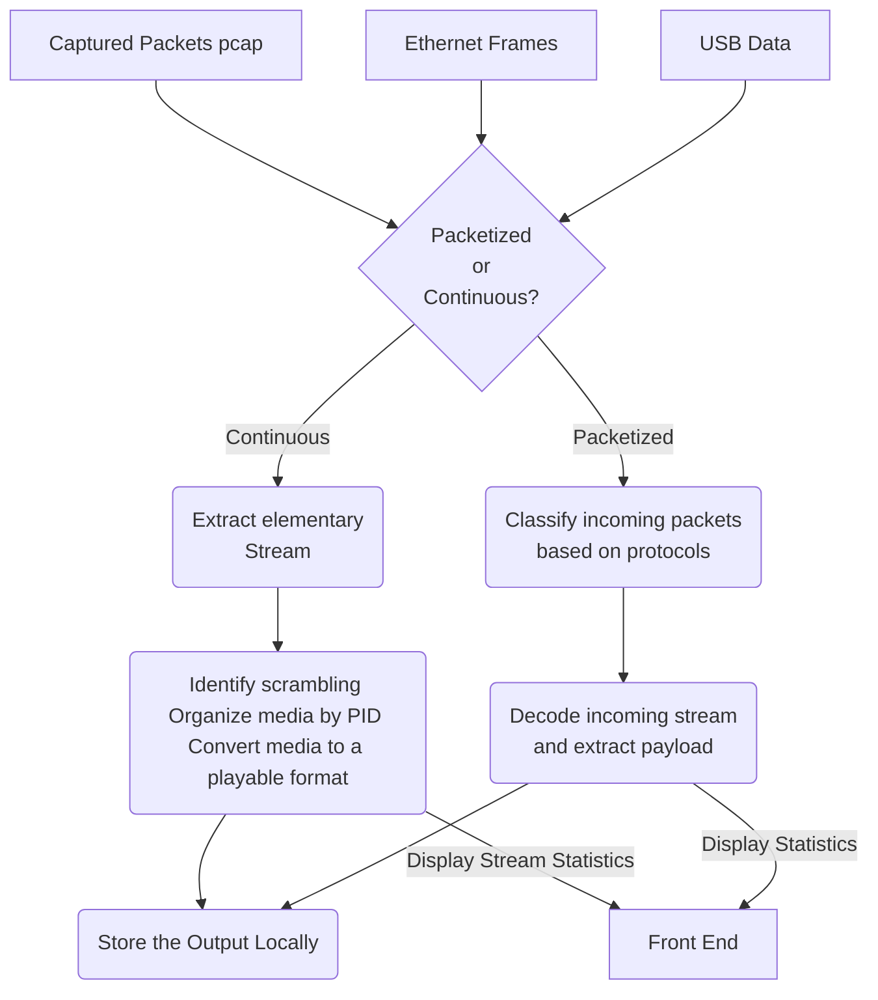
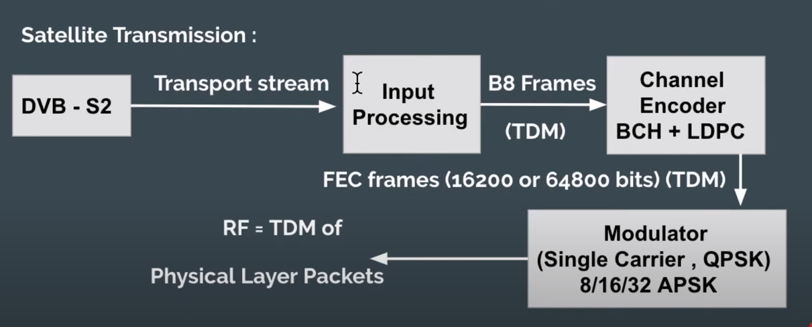

# DVBS2 toolkit

## Smart India Hackathon 2023 
Software Edition 

## Problem statement
### Problem Statement Title	
Development of software application for analysis and processing of dvbs2 receiver output stream i.e., raw BB Frames, GSE and TS in near real time.
### Description	
1. Classification & identification of audio, video, data & protocol such as MPE, ULE, SIP, RTP, FTP, SFTP, HTTP, HTTPS, SNMP, POP, SMTP, SSH etc. 
2. Classification Identification of encryption/scrambling if present in stream through headers and SI tables 
3. Extraction of VoIP calls, audio and video programs, file, email, web-page etc in separate files. 
4. Decoding and playing selected audio/video contents Preferred Language- Python, Lab-view, C/C++, VHDL/Verilog Expected Outcome- Algorithm/Software/GUI Preferred Platform- Windows/Linux

### Project Cloning Setup and Guide
#### Prerequisites
- Python 3
- Node.js (for React)
- Python virtualenv package

#### Clone the repository
```bash
git clone https://github.com/Chandolkar001/SIH23-DVBS2.git
cd SIH23-DVBS2
```

#### Creating Python Virtual Enviornment (Ubuntu)
```bash
cd server
virtualenv venv
source venv/bin/activate
pip3 install -r requirements.txt
```
#### Run backend server
```
cd server
python manage.py runserver
```
Backend server listens on localhost:8000

#### Run frontend
```
cd client
npm run start
```
Frontend listens on localhost:3000

### Lifecycle of an Incoming packet



### DVBS2 architecture

<br>Source: Resource no. 1 Complete DVBS2 documentation

## Available libraries and tools
1. https://github.com/igorauad/gr-dvbs2rx </br>
GNU Radio based Software defined radio tool kit.
This repository can be used directly to transmit DVBS2 signals on software defined radio, i.e on the system itself and then recieve the DVBS2 signals again on the system itself. The repo contains example codes and installation instructions.<br>
2. https://tsduck.io/ <br>
This is a transport stream toolkit. It can be used for generating raw TS frames as well for analyzing TS frames.
It can also be used for <b>MPE</b> packetization for application layer protocols.
It has two modes, programming mode where we can use the C++ based APIs in our script, or CLI mode, where terminal commands can be used to preform the operations.
3. https://ffmpeg.org/ <br>
This library can be used for converting TS frames to .mp4 format and vice-versa. It can also be used for converting various 
4. https://www.gnuradio.org/ <br>
This is a software defined radio toolkit, mainly used for generating and performing all the SDR operations.<br>
(Preferably not useful for us because of the complexity.)
5. https://pypi.org/project/pyshark/ <br>
Pyshark is a python wrapper for tshark. It is used for packet analysis similar to Wireshark.
6. https://scapy.net/ Python package to generate customized packets.
7. https://github.com/CNES/libgse/tree/master GSE packet header extraction, encapsulation, decapsulation, etc using C library functions.
8. https://github.com/ssloxford/gsextract Requires an input file with DVB-S BB frames and gives output as pcap file with containing all the internet traffic transmitted through DVB.
9. https://www.opensand.org/index.html Emulator for end-end Satellite comm system that also includes IP datagrams.

## Resources
Video resources and documentation.
1. [Link](https://www.etsi.org/deliver/etsi_en/302300_302399/30230701/01.04.01_20/en_30230701v010401a.pdf) - Complete DVBS2 documentation
2. https://youtu.be/nXenBqdzLbs?si=EtbaeYPTZ2UNpQnr dvbs2 frame
3. https://youtu.be/NnuLbmaeuNI?si=937mIHfPdlokbgva dvbs2 architecture 
4. https://en.wikipedia.org/wiki/Generic_Stream_Encapsulation GSE
5. https://en.wikipedia.org/wiki/MPEG_transport_stream TS
6. https://tsduck.io/download/docs/mpegts-introduction.pdf TSDUCK MPEG-TS intro 
7. https://erg.abdn.ac.uk/future-net/digital-video/ dvb
8. https://tsduck.io/download/docs/tsduck.pdf user's guide for TSDUCK
9. https://wiki.sans.blue/Tools/pdfs/ScapyCheatSheet_v0.2.pdf scapy cheatsheet
10. [Link](https://www.etsi.org/deliver/etsi_en/302300_302399/30230701/01.04.01_20/en_30230701v010401a.pdf) - Standard BB Header configurations based on different applications. Refer Page no 62, Table D.2
11. [Link](https://sci-hub.se/https://ieeexplore.ieee.org/document/4409401) - GSE, MPE, ULE based encapsulation methods. Refer Page no 1 and 2.

## Tasks
- [ ] Multithreading/ multicore operations for file processing.
- [ ] Develop separate modules for TS and GSE processing.
- [ ] Integrate interfaces<br>
        1. wlan
        2. eth
        3. usb
