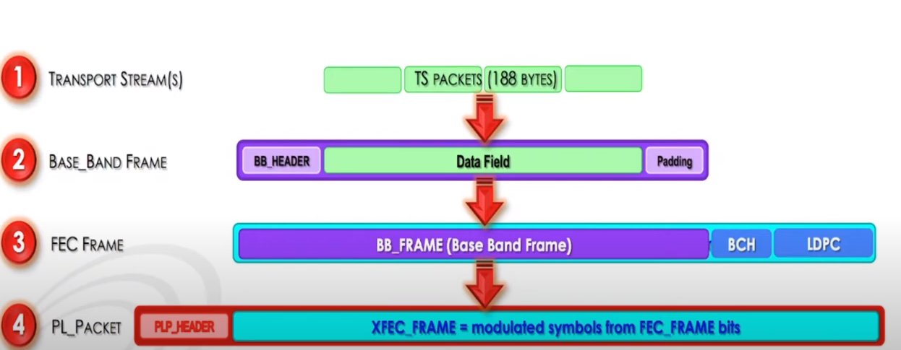
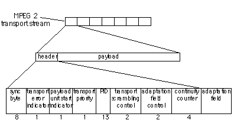
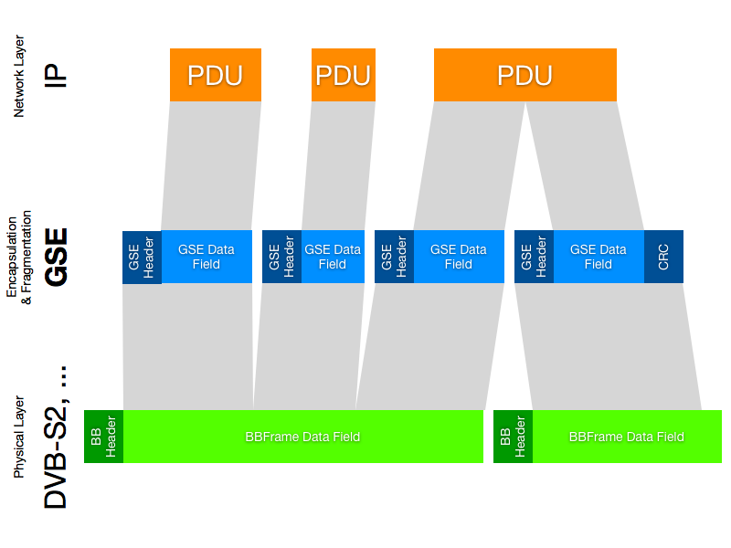
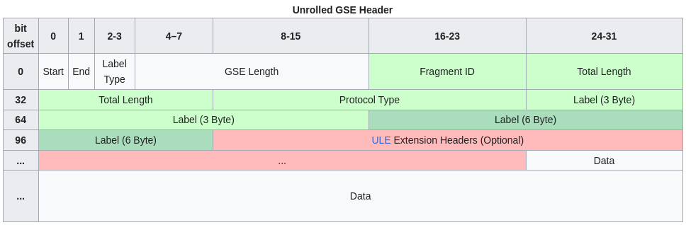

# Smart India Hackathon 2023 
Software Edition 

## Problem statement
### Problem Statement Title	
Development of software application for analysis and processing of dvbs2 receiver output stream i.e., raw BB Frames, GSE and TS in near real time.
### Description	
1. Classification & identification of audio, video, data & protocol such as MPE, ULE, SIP, RTP, FTP, SFTP, HTTP, HTTPS, SNMP, POP, SMTP, SSH etc. 
2. Classification Identification of encryption/scrambling if present in stream through headers and SI tables 
3. Extraction of VoIP calls, audio and video programs, file, email, web-page etc in separate files. 
4. Decoding and playing selected audio/video contents Preferred Language- Python, Lab-view, C/C++, VHDL/Verilog Expected Outcome- Algorithm/Software/GUI Preferred Platform- Windows/Linux

## Study
DVBS2 is a standard for live video broadcasting, and data transfer through satellite link. It is populary used for Dish TV applications.

### DVBS2 architecture


### DVBS2 system block diagram


### DVBS2 frame


Based on the mentioned architecture and system block diagram, for transmitting any data content using DVBS2, it needs to be first converted to a stream format before passing it to BB frames. There are two stream formats available for DVBS2 standard.

```
Audio, Video, Subtitles (.mp4, .av, etc) - TS encapsulation 
IP Packets (UDP packets, HTTP packets, etc) - GSE encapsulation 
```

#### Transport Stream (TS):
Purpose: <br>
Transport Stream is a standard for the transmission and storage of audio, video, and data, primarily used in digital broadcasting and streaming. It is commonly employed in DVB, ATSC (Advanced Television Systems Committee), and other standards.

Structure:<br>



TS has a fixed packet size of 188 bytes. Each packet consists of a 4-byte header and a 184-byte payload. TS packets may carry audio, video, or other data, and they are identified by a Packet Identifier (PID) in the header.

#### Generic Stream Encapsulation (GSE):



Purpose:<br>
Generic Stream Encapsulation, or GSE for short, is a <b><u>Data link layer</u></b> protocol defined by DVB. GSE provides means to carry packet oriented protocols such as IP on top of uni-directional physical layers such as DVB-S2, DVB-T2 and DVB-C2.

Structure:<br>



GSE packets encapsulate IP packets and are variable in length, making them more adaptable to the varying sizes of IP packets. GSE introduces a set of headers that provide information about the encapsulated IP packet, such as length, protocol type, and other metadata.

Fragmentation and Reassembly:<br>
The basic mechanism of GSE payload fragmentation uses the Start and End Flags, where the Start flag indicates the beginning of a payload frame, and the End flag indicates its end. This is shown in the table below.

| Start | End | GSE Packet Content                |
|-------|-----|----------------------------------|
| 1     | 0   | Total payload size / Protocol type / Payload start |
| 0     | 0   | Payload continuation              |
| 0     | 1   | Payload end / CRC-32              |
<br>

## Available libraries and tools
1. https://github.com/igorauad/gr-dvbs2rx </br>
GNU Radio based Software defined radio tool kit.
This repository can be used directly to transmit DVBS2 signals on software defined radio, i.e on the system itself and then recieve the DVBS2 signals again on the system itself. The repo contains example codes and installation instructions.<br>
2. https://tsduck.io/ <br>
This is a transport stream toolkit. It can be used for generating raw TS frames as well for analyzing TS frames.
It can also be used for <b>MPE</b> packetization for application layer protocols.
It has two modes, programming mode where we can use the C++ based APIs in our script, or CLI mode, where terminal commands can be used to preform the operations.
3. https://ffmpeg.org/ <br>
This library can be used for converting TS frames to .mp4 format and vice-versa. It can also be used for converting various 
4. https://www.gnuradio.org/ <br>
This is a software defined radio toolkit, mainly used generating and performing all the SDR operations.<br>
(Preferably not useful for us because of the complexity.)
5. https://pypi.org/project/pyshark/ <br>
Pyshark is a python wrapper for tshark. It is used for packet analysis similar to Wireshark.
<br><br>

## Resources
Video resources and documentation.
1. https://youtu.be/nXenBqdzLbs?si=EtbaeYPTZ2UNpQnr dvbs2 frame
2. https://youtu.be/NnuLbmaeuNI?si=937mIHfPdlokbgva dvbs2 architecture 
3. https://en.wikipedia.org/wiki/Generic_Stream_Encapsulation GSE
4. https://en.wikipedia.org/wiki/MPEG_transport_stream TS
5. https://tsduck.io/download/docs/mpegts-introduction.pdf TSDUCK MPEG-TS intro
6. https://erg.abdn.ac.uk/future-net/digital-video/ dvb
