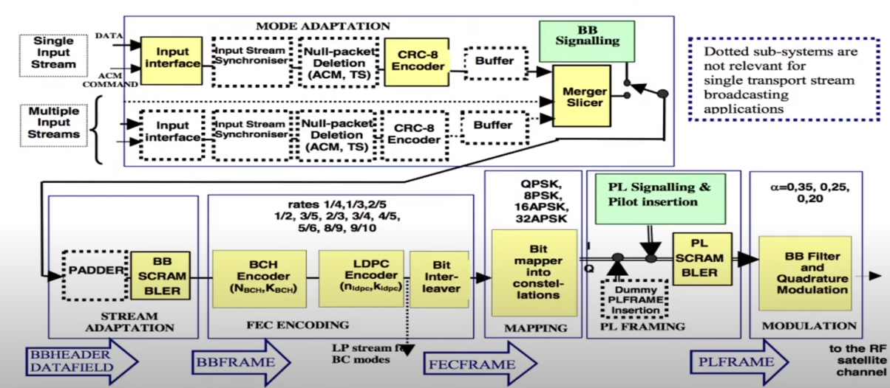

# Smart India Hackathon 2023 
Software Edition 

## Problem statement
### Problem Statement Title	
Development of software application for analysis and processing of dvbs2 receiver output stream i.e., raw BB Frames, GSE and TS in near real time.
### Description	
1. Classification & identification of audio, video, data & protocol such as MPE, ULE, SIP, RTP, FTP, SFTP, HTTP, HTTPS, SNMP, POP, SMTP, SSH etc. 
2. Classification Identification of encryption/scrambling if present in stream through headers and SI tables 
3. Extraction of VoIP calls, audio and video programs, file, email, web-page etc in separate files. 
4. Decoding and playing selected audio/video contents Preferred Language- Python, Lab-view, C/C++, VHDL/Verilog Expected Outcome- Algorithm/Software/GUI Preferred Platform- Windows/Linux

### Project Cloning Setup and Guide
#### Prerequisites
- Python 3
- Node.js (for React)
- Python virtualenv package

#### Clone the repository
```bash
git clone https://github.com/Chandolkar001/SIH23-DVBS2.git
cd SIH23-DVBS2
```

#### Creating Python Virtual Enviornment (Ubuntu)
```bash
cd server
virtualenv venv
source venv/bin/activate
pip3 install -r requirements.txt
```

## Tasks

### Backend Server
### BB Frame

- [ ] Study GSE header and payload
- [ ] Extract TS (stream/packetized) and GSE (stream/packetized) data from BB frames
- [ ] Generate dummy test data for all the input streams
- [ ] Find libraries and packages
- [ ] Categorize Continous and Packet data based on BB Header.

### Continous Data analyzer
- [ ] Convert to av format (.av, .mp4, etc) based on TS or GSE.
- [ ] store the data according to the type of media.
- [ ] If it is live-broadcasting, directly pass the feed to frontend using Django-channels

### Packet Data analyzer
- [ ] De-encapsulate based on GSE or TS.
- [ ] Use Scapy/ Pyshark to analyze and extract data from packets.
- [ ] Convert raw data to readable data.
- [ ] Categorize the raw data and store the data according to the type of media(image, video, audio, webpages, email, etc).
- [ ] API - Send packets to frontend.

### Storage 
- [ ] API - Access all the stored media and play it dynamically.

<!-- ### GUI

- [ ] Create a GUI using packages, fix one standard package for final implementation.
- [ ] Integrate and display basic audio video files on the GUI.
- [ ] CLI based application approach (optional) -->


### Test cases generation 

- [ ] Use [dvbs2](https://github.com/igorauad/gr-dvbs2rx) to generate SDR based input test cases for MPEG-TS stream.
- [ ] Search for other GNU Radio - SDR based projects for dvbs2 test case generation 

## Study
DVBS2 is a standard for live video broadcasting, and data transfer through satellite link. It is populary used for Dish TV applications.

### DVBS2 architecture


### DVBS2 system block diagram


<br>

```
All types of data, including audio, video, text, etc., should be in stream format before reaching the baseband frame, which is then forwarded as DVB-S2.
```
### The input stream sequences are:
 - TS continuous single stream
 - TS continous multiple stream
 - TS packetized stream using MPE 
 - GSE continous single stream
 - GSE continous multiple stream
 - GSE packetized stream

#### Mode Adaption block
This sub-system shall perform Input Interfacing, Input Stream Synchronization (optional), Null-packet deletion (for TS
input streams and ACM only), CRC-8 encoding for error detection (for packetized input streams only), input stream
merging (for multiple input streams only) and input stream slicing in DATA FIELDs. Finally, base-band signalling
shall be inserted, to notify the receiver of the adopted Mode Adaptation format.
The output sequence is a BBHEADER (80 bits) followed by a DATA FIELD.


### Refer Page no 1 and 2 for GSE, MPE, ULE based encapsulation methods
https://sci-hub.se/https://ieeexplore.ieee.org/document/4409401 <br>


### BB Header 
A fixed length base-band Header of 10 bytes. 
Describes the format of the DATA FIELD.

| Field      | Size in Bytes | Description                                               | Values                                                                        |
|--------------|---|-----------------------------------------------------------|-------------------------------------------------------------------------------|
| MATYPE 1    | 1 | Input stream(s) format, Mode Adaptation, and Roll-off factor. | First byte (MATYPE-1): TS/GS (2 bits), SIS/MIS (1 bit), CCM/ACM (1 bit), ISSYI (1 bit), NPD (1 bit), RO (2 bits). |
| MATYPE 2   | 1 |                                                           | Second byte (MATYPE-2): If SIS/MIS = Multiple Input Stream, then ISI; else reserved. |
| UPL        | 2 | User Packet Length in bits (0 to 65,535).                 | Example 1: 0000HEX = continuous stream. Example 2: 000AHEX = UP length of 10 bits. Example 3: UPL = 188x8D for MPEG transport stream packets. |
| DFL        | 2 | Data Field Length in bits (0 to 58,112).                 | Example 4: 000AHEX = Data Field length of 10 bits. |
| SYNC       | 1 | Copy of the User Packet Sync-byte.                        | Example 5: SYNC = 47HEX for MPEG transport stream packets. Example 6: SYNC = 00HEX when the input Generic packetized stream did not contain a sync-byte. |
| SYNCD     | 2 | Distance in bits from the beginning of the DATA FIELD to the first UP. | For packetized Transport or Generic Streams: SYNCD = 65535D (no UP starts in the DATA FIELD). For Continuous Generic Streams: SYNCD= 0000 - FFFF (reserved for future uses). |
| CRC-8     | 1 | Error detection code applied to the first 9 bytes of the BBHEADER. | Computed using the encoding circuit of figure 2 (switch in A for 72 bits, in B for 8 bits). |


### BB Header MATYPE-1 (1 byte) field mapping
| Field | Description | Values | size in bits |
|---|---|---|---|
| TS/GS | Transport Stream or Generic Stream | 11 = Transport, 00 = Generic packetized, 01 = Generic continuous, 10 = reserved | 2 |
| SIS/MIS | Single Input Stream or Multiple Input Stream | 1 = Single, 0 = Multiple | 1 |
| CCM/ACM | Constant Coding and Modulation or Adaptive Coding and Modulation | 1 = CCM, 0 = ACM | 1 |
| ISSYI | Input Stream Synchronization Indicator | 1 = Active, 0 = Not Active | 1 |
| NPD | Null-Packet Deletion | 1 = Active, 0 = Not Active | 1 |
| RO | Transmission Roll-off factor | 00 = 0.35, 01 = 0.25, 10 = 0.20, 11 = reserved | 2 |


#### Standard BB Header configurations based on different applications
https://www.etsi.org/deliver/etsi_en/302300_302399/30230701/01.04.01_20/en_30230701v010401a.pdf <br>
Refer Page no 62, Table D.2


## Available libraries and tools
1. https://github.com/igorauad/gr-dvbs2rx </br>
GNU Radio based Software defined radio tool kit.
This repository can be used directly to transmit DVBS2 signals on software defined radio, i.e on the system itself and then recieve the DVBS2 signals again on the system itself. The repo contains example codes and installation instructions.<br>
2. https://tsduck.io/ <br>
This is a transport stream toolkit. It can be used for generating raw TS frames as well for analyzing TS frames.
It can also be used for <b>MPE</b> packetization for application layer protocols.
It has two modes, programming mode where we can use the C++ based APIs in our script, or CLI mode, where terminal commands can be used to preform the operations.
3. https://ffmpeg.org/ <br>
This library can be used for converting TS frames to .mp4 format and vice-versa. It can also be used for converting various 
4. https://www.gnuradio.org/ <br>
This is a software defined radio toolkit, mainly used for generating and performing all the SDR operations.<br>
(Preferably not useful for us because of the complexity.)
5. https://pypi.org/project/pyshark/ <br>
Pyshark is a python wrapper for tshark. It is used for packet analysis similar to Wireshark.
6. https://scapy.net/ Python package to generate customized packets.
<br>
7. https://github.com/CNES/libgse/tree/master GSE packet header extraction, encapsulation, decapsulation, etc using C library functions.
8. https://github.com/ssloxford/gsextract Requires an input file with DVB-S BB frames and gives output as pcap file with containing all the internet traffic transmitted through DVB.
9. https://www.opensand.org/index.html Emulator for end-end Satellite comm system that also includes IP datagrams.

## Resources
Video resources and documentation.
1. https://www.etsi.org/deliver/etsi_en/302300_302399/30230701/01.04.01_20/en_30230701v010401a.pdf Complete DVBS2 documentation
2. https://youtu.be/nXenBqdzLbs?si=EtbaeYPTZ2UNpQnr dvbs2 frame
3. https://youtu.be/NnuLbmaeuNI?si=937mIHfPdlokbgva dvbs2 architecture 
4. https://en.wikipedia.org/wiki/Generic_Stream_Encapsulation GSE
5. https://en.wikipedia.org/wiki/MPEG_transport_stream TS
6. https://tsduck.io/download/docs/mpegts-introduction.pdf TSDUCK MPEG-TS intro 
7. https://erg.abdn.ac.uk/future-net/digital-video/ dvb
8. https://tsduck.io/download/docs/tsduck.pdf user's guide for TSDUCK
9. https://wiki.sans.blue/Tools/pdfs/ScapyCheatSheet_v0.2.pdf scapy cheatsheet